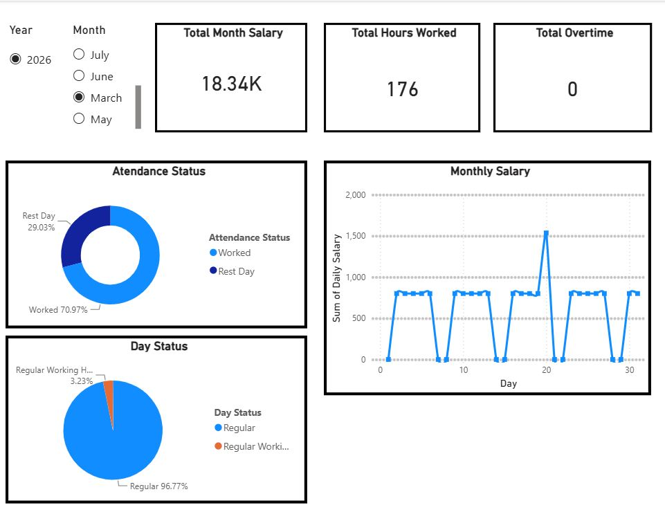
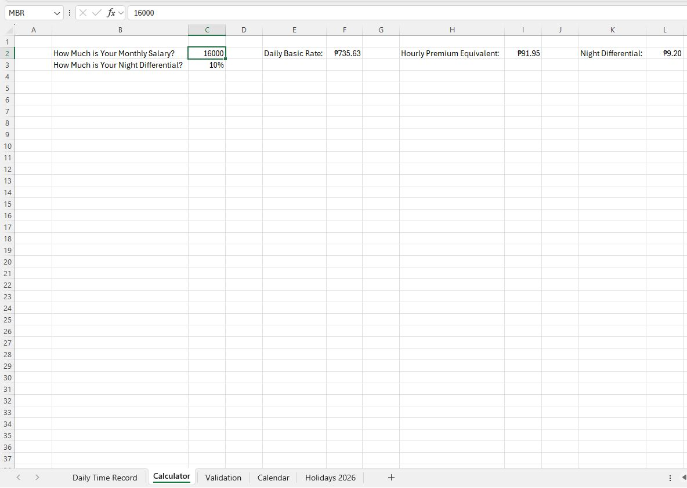
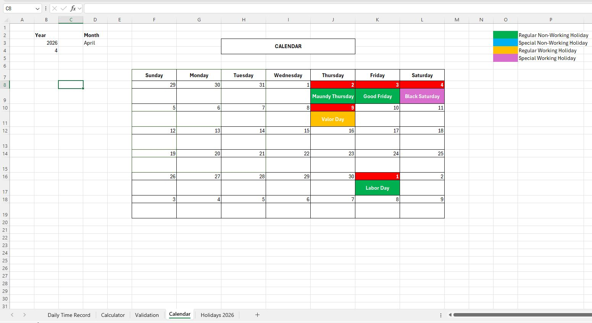
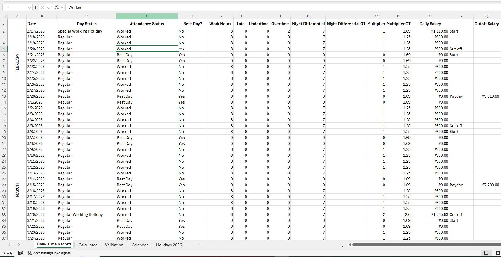
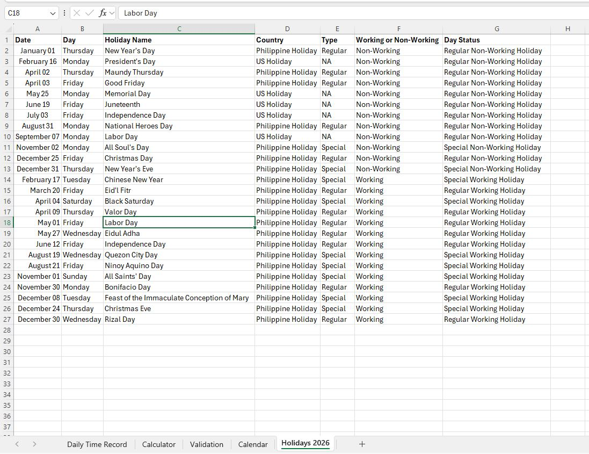
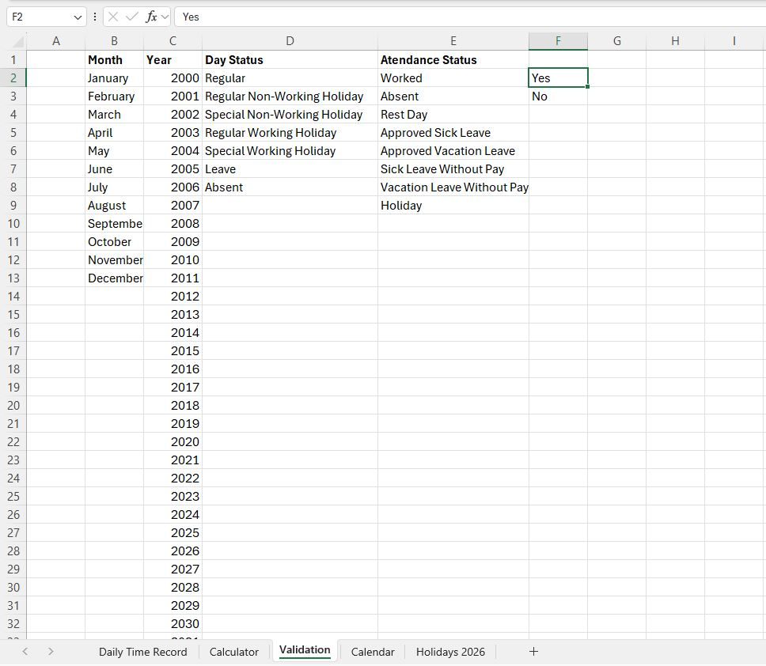

# My-Salary-Calculator

A comprehensive payroll tracking and analytics system designed to automate salary calculations, manage attendance logs, and visualize monthly earnings. This project combines the granular computational power of Microsoft Excel with dynamic data visualizations in Power BI.

---

## 📊 Project Dashboard
Translated dense spreadsheet rows into high-level business intelligence insights to track financial and operational performance metrics.

### Key Performance Metrics:
* **Total Month Salary:** Dynamically displays gross earnings for the selected fiscal month.
* **Attendance & Day Status Breakdown:** Visualizes ratios between active workdays versus scheduled rest days.
* **Monthly Salary Trend:** A line graph mapping daily earnings to reveal peaks caused by premium holiday multipliers or overtime.

---

## 🛠️ Tech Stack
* **Data Processing & Logic:** Microsoft Excel (`SALARY TRACKER PROJECT.xlsb.xlsx`)
* **Data Visualization:** Power BI Desktop (`Salary Tracker.pbix`)

---

## 🧮 Excel Core Engine (Data Sheets)

### 1. Calculator Sheet
The control panel of the workbook where base variables are established. It configures base monthly salary inputs and calculates the corresponding **Daily Basic Rate**, **Hourly Premium Equivalent**, and **Night Differential** rates.

### 2. Calendar Sheet
A dynamic visual schedule helper mapping out specific months. It integrates color-coded legends to easily differentiate standard workdays from regional holidays.

### 3. Daily Time Record (DTR)
The raw transactional log where individual day-to-day data is inputted. It tracks operational variables like work hours, overtime, and night shifts, automatically computing the final `Daily Salary`.

### 4. Holidays 2026 Sheet
The reference database powering the workbook's holiday logic. It catalogs and classifies official holiday schedules across different regions to ensure compliance with legal payroll guidelines.

### 5. Validation Sheet
Maintains clean backend architecture and data integrity. It houses static source lists for dropdown menus utilized across the data-entry sheets to prevent user entry errors.

---

## 💡 How to Use
1. **Setup Rates:** Open the Excel file and navigate to the `Calculator` sheet to update your target Monthly Salary.
2. **Log Hours:** Record daily attendance, night shift hours, or overtime inside the `Daily Time Record` sheet.
3. **View Visuals:** Refresh the connected Power BI template file to populate the interactive dashboard charts with your updated logs.
# My-Salary-Calculator
